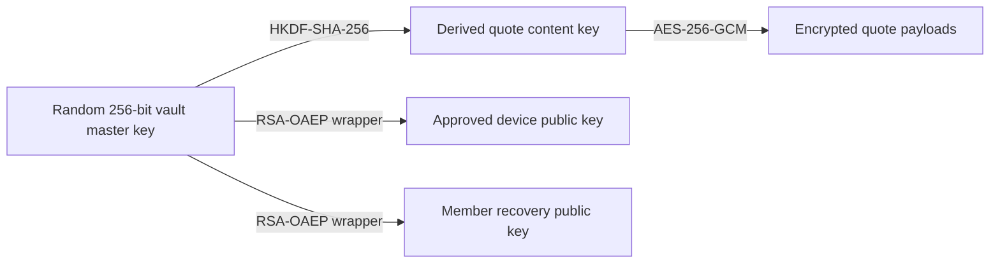

# QuoteVault device envelope encryption design

**Status:** Approved design

**Date:** 2026-09-22

**Scope:** Replace the repeatedly entered group vault key while preserving end-to-end encryption, offline access, recovery, member removal, and support for current mainstream browsers.

## Goals

- Keep quote contents unreadable to Supabase, the VPS, and database administrators.
- Let members unlock approved devices without repeatedly entering a shared group key.
- Support current Safari, Chrome, Edge, and Firefox on iPhone, iPad, Android, macOS, Windows, and Linux.
- Preserve offline reading and editing for 30 days after a successful authorization check.
- Approve new devices from an existing unlocked device, with admin help for first-device enrollment and recovery.
- Give every member a personal recovery phrase rather than another shared secret.
- Revoke server access immediately and optionally rotate encryption when a member is removed.
- Migrate every current quote in place without losing authors, context, provenance, revisions, or pending changes.

## Non-goals and security limits

- QuoteVault cannot erase plaintext or keys that a former member copied before removal.
- A browser cannot provide cryptographically enforceable remote wipe or a trusted offline clock.
- A compromised unlocked device can expose the plaintext shown on that device.
- A malicious application deployment could capture secrets during unlock. Deployment access, a strict Content Security Policy, and the absence of third-party scripts remain part of the trust boundary.
- The design does not add server-side plaintext search, analytics, or message processing.
- Legacy browsers outside the current mainstream browser matrix are not required.

## Existing system

The current client derives a non-extractable AES-GCM key from one shared passphrase using PBKDF2. The passphrase and derived key stay in memory, so a reload requires the shared key again. Supabase stores ciphertext, public derivation settings, synchronization revisions, and authorization metadata.

The existing allowlist remains the source of membership. Administrators add and remove allowed email addresses. The existing `vault_state` generation and revision remain the synchronization authority. The destructive `rotate_vault` operation must not be reused for this migration or for retained-history rotation.

## Chosen architecture

QuoteVault will use envelope encryption with one random vault master key per active vault generation.

The server stores separate encrypted copies, or wrappers, of the same vault master key for every approved device and every active member recovery key. Possession of one wrapper is insufficient without its matching private key.

### Vault and quote keys

- Generate each vault master key as 32 random bytes with `crypto.getRandomValues`.
- Identify each key generation with an unpredictable UUID.
- Derive the quote content key with HKDF-SHA-256 and purpose-bound information containing the encryption schema and generation.
- Import ordinary content keys as non-extractable Web Crypto keys.
- Encrypt quote payloads with AES-256-GCM and a fresh 96-bit nonce.
- Authenticate the payload schema, quote ID, and generation as additional authenticated data.
- Keep quote plaintext and usable vault keys only in browser memory while unlocked.

The encrypted quote payload continues to contain all private fields together, including text, authors, context, original sender, and import provenance. Visible copies of creator, creation time, and quote date used for synchronization are duplicated inside the authenticated payload and compared after decryption. A mismatch rejects the record. Server-managed generation and revision remain authoritative operational metadata.

### Device keys

Each approved device creates a 3072-bit RSA-OAEP keypair with SHA-256 and public exponent 65537 using browser-native Web Crypto. Public keys use versioned JWK serialization. RSA-OAEP is selected because current target browsers support it consistently and the wrapped value is small.

- Supabase stores the public key and the vault-key wrapper.
- The private key is exported only during initial creation, immediately encrypted, and then discarded from application variables.
- At unlock, the client decrypts the private key and imports it as non-extractable for the current session.
- The decrypted private key and vault key are cleared from application state on lock, sign-out, generation change, and tab teardown on a best-effort basis.
- Private-key ciphertext authenticates the account, device ID, public-key fingerprint, protection mode, and format version as AES-GCM additional data.
- The device also generates a random 256-bit authorization token. Supabase stores only its SHA-256 digest; the token is encrypted inside the same private device bundle.

Each RSA-OAEP wrapper contains a small versioned payload with the vault ID, generation, target public-key fingerprint, and vault master key. The client validates every field after decryption before accepting the key, preventing a valid wrapper from being silently moved to another device or generation.

There are two private-key protection modes:

1. **Passkey PRF:** use a WebAuthn PRF result as input to purpose-bound HKDF, then use the result to encrypt the private device bundle. Persist the credential ID, a random 32-byte PRF salt, RP ID `quotes.darkmg1.dev`, KDF parameters, public-key fingerprint, and format version as authenticated public parameters. Registration and restoration use server-generated WebAuthn challenges and require user verification. Offline unlock uses a fresh client-generated challenge because no assertion is sent to a server; the PRF result and user verification are the required local outputs. The encrypted private bundle may be stored in Supabase and cached locally. If the same PRF-capable passkey remains available after browser data is cleared, the member can restore that device credential.
2. **Remember this device:** generate a non-extractable AES-GCM key in IndexedDB and use it to encrypt the private device bundle locally. Clearing QuoteVault site data destroys this local unlocking key, so another device, the recovery phrase, or an admin must approve a replacement.

PRF support is feature-detected for the actual browser and authenticator. QuoteVault never treats passkey support alone as the universal recovery path.

### Recovery keys

Every member creates a separate 3072-bit RSA-OAEP keypair with SHA-256 and public exponent 65537. Recovery public keys also use versioned JWK serialization. This extra layer is required so vault rotation does not require every member to be online.

- QuoteVault generates a personal phrase with at least 128 bits of cryptographic entropy.
- The phrase derives a recovery encryption key using PBKDF2-HMAC-SHA-256 with 600,000 iterations, a random per-member salt, and versioned parameters so the cost can be raised later.
- The derived key encrypts the member's recovery private key with the account, recovery-key ID, public-key fingerprint, KDF parameters, and format version authenticated as additional data.
- Supabase stores the encrypted recovery private key, its public derivation parameters, the recovery public key, and a vault-key wrapper encrypted to that public key.
- Supabase never receives the phrase, its derived key, or an unencrypted private recovery key.

During vault rotation, an unlocked administrator can encrypt the new vault key to every remaining member's public recovery key. The administrator never needs the member's phrase or private recovery key.

## Server-side records

The implementation should extend `vault_state` and add the following narrowly scoped records. Exact SQL names may follow repository conventions, but the security relationships must remain unchanged.

- **Devices:** owner, label, public key, authorization-token digest, private-key protection mode, authenticated PRF parameters, encrypted private bundle when applicable, status, creation time, last successful sync, lease expiry, and revocation time.
- **Device vault-key wrappers:** generation, device, wrapped vault key, creator, and creation time.
- **Member recovery keys:** owner, recovery public key, encrypted recovery private key, KDF parameters, status, and creation time.
- **Recovery vault-key wrappers:** generation, recovery key, wrapped vault key, creator, and creation time.
- **Approval requests:** requesting account, proposed device public key, expiry, state, and approving device.
- **Security events:** event type, actor, affected member or device, timestamp, and minimal non-secret metadata.
- **Migration staging:** staged target ciphertext plus an inactive rollback snapshot of the source ciphertext and vault state. Direct quote APIs never expose the rollback set. It is deleted after production acceptance and has a hard retention limit of seven days.

RLS must bind devices and recovery records to their authenticated owners. Members may read their own encrypted material; changes to active devices or recovery records require an authorized-device, recovery, or admin-assisted RPC rather than direct table writes. Administrators may approve first devices, assist recovery, revoke access, and read the public information required to create wrappers. No policy or security-definer function may return private quote plaintext or an unwrapped vault key.

After device-envelope cutover, every state, wrapper, sync, import, edit, rotation, and migration RPC must require the authenticated account, device ID, and device authorization token. A shared authorization helper hashes the token and verifies all of the following in one database transaction:

- The account is still allowlisted and owns the device, unless the operation explicitly requires an administrator.
- The device is active and not revoked. An online lease-renewal operation may reauthorize an expired active device after the other checks pass.
- The supplied token digest matches the stored digest.
- The requested generation is valid for that operation.

The helper exposes no secret data and returns only the authorization result needed by the calling RPC. Enrollment and recovery RPCs are the only narrow exceptions; they operate on expiring pending requests and cannot read quotes or active wrappers until approval succeeds. Direct table grants do not provide a path around these RPC checks.

Member removal and device revocation lock the affected device rows before marking them revoked. Sync and mutation RPCs lock and authorize the device row before changing quotes. Database lock order therefore determines whether an already in-flight request finishes before revocation or is rejected afterward; no later request can pass with a stale Supabase session.

## Member and device enrollment

### Membership

Administrators continue to add an email to the existing allowlist. This authorizes account membership but does not itself provide a vault key.

### First device

1. The allowlisted member signs in.
2. The browser generates its device keypair and authorization token, then submits an approval request containing its public key, token digest, protection metadata, and descriptive metadata. Any encrypted private bundle remains ciphertext.
3. QuoteVault shows an opaque request QR code and a short verification code derived from the request and enrollment fingerprint.
4. An unlocked administrator opens the request, verifies the email, device description, and matching code, and approves it.
5. The administrator's client encrypts the active vault key, or the prepared target key during initial migration, to the proposed device public key and calls the approval RPC with the wrapper and expected enrollment fingerprint.
6. The approval RPC locks the pending request, verifies the approver, expiry, allowlist membership, and fingerprint, then atomically creates the device with its public key and token digest, stores the wrapper, consumes the request, and records the security event.
7. The new device completes enrollment by presenting its device ID and raw authorization token. The server hashes and verifies the token before returning the wrapper and first lease.
8. The new device decrypts its wrapper locally and verifies the vault.
9. The member creates and confirms a personal recovery phrase before enrollment is considered complete.

### Additional devices

An existing unlocked device belonging to the same member may approve another device through the same QR or short-code flow. An administrator may also approve it. Approval requests are single-use and expire after ten minutes.

The QR code contains a high-entropy request identifier and enrollment fingerprint, never the vault key or a reusable unlocking secret. The fingerprint covers the proposed public key, authorization-token digest, protection parameters, and account. The approving browser derives and displays the verification code rather than trusting a server-provided display value.

### Restoring a passkey-protected device

If local site data is cleared but the same PRF-capable passkey remains available, the member may sign in and use it to decrypt the server-stored private-key blob. QuoteVault records the restored browser instance and renews authorization only after confirming that the account, credential, device record, and generation are still active.

A synced passkey may make this restoration possible on another physical device. The UI must describe that behavior and identify the passkey provider's sync and recovery security as part of the trust boundary. If the recorded credential, PRF support, or user verification is unavailable, restoration stops and offers existing-device approval, personal recovery, or admin-assisted recovery.

## Unlocking and offline operation

### Unlock

- A PRF-capable device performs WebAuthn user verification, derives its local wrapping key, and opens the encrypted device private key.
- A remembered device uses its non-extractable IndexedDB key after an explicit local unlock action.
- The device private key decrypts the current vault-key wrapper.
- The vault key derives the non-extractable quote content key and verifies the vault before any quote is displayed.

Anyone who can use an unlocked OS and browser profile can use a remembered device. The UI states this trade-off when the member selects that mode.

### Thirty-day authorization lease

Every successful authenticated synchronization returns a versioned device lease with its device, account, generation, issue time, and expiry time covered by an ECDSA P-256 server signature. The client caches the lease and verifies it offline with a pinned public verification key. The private lease-signing key never ships to the browser or resides in client-readable database rows.

- An unexpired lease allows offline unlock, reading, adding, editing, and deletion.
- QuoteVault checks expiry at startup, app resume, unlock, and before accepting a new local mutation.
- While the app remains open in the foreground, it schedules a lock at lease expiry.
- After expiry, the app keeps ciphertext intact but requires an online authorization check before decrypting or changing the vault.
- Revocation blocks the next online sync immediately.
- An expired but otherwise active device can renew online after Supabase authentication and device-token verification; lease expiry alone does not force recovery or re-enrollment.

This lease is a product authorization control, not remote wipe. A user who controls the browser, clock, and application code may bypass an offline expiry check. Rotation is the cryptographic control for future data.

### Synchronization

The existing encrypted queue and revision checks remain the synchronization mechanism.

- Reconnection, returning to a visible page, and successful session restoration request a sync.
- A visible **Sync now** action retries manually and reports pending count, last successful sync, and actionable failures.
- Successful sync renews the authorization lease.
- Operations include their encryption generation. The server rejects revoked devices and obsolete generations.
- `get_vault_state`, `sync_quotes`, `checked_import`, `edit_quote`, `edit_quotes`, wrapper fetches, and their replacement migration or rotation RPCs all use the shared device authorization check.
- Permission errors do not retry forever. Temporary failures keep the encrypted operation queued with bounded backoff.
- Conflicting edits continue to use the current revision-based conflict behavior; this project does not introduce a second synchronization engine.

### Lock and forget

- **Lock** clears decrypted keys and quote plaintext from application state immediately while retaining encrypted offline data.
- **Forget this device** deletes local device keys, encrypted offline data, and caches. Online use also revokes the server record. A passkey-protected device must be online for the full forget operation because its encrypted private key may be restorable from the server; while offline, QuoteVault offers a clearly labeled local-data deletion and directs the member to revoke the server record later. A remembered device becomes cryptographically unusable when its local non-extractable key is deleted.

## Recovery

### Personal recovery

1. The member signs in to the allowlisted account.
2. The member enters the personal recovery phrase locally.
3. QuoteVault derives the recovery encryption key and decrypts the recovery private key.
4. The server creates a random 256-bit challenge, encrypts it to the recovery public key, and stores the expected value only for the short life of the request.
5. The recovery private key decrypts the challenge and the client returns the plaintext challenge to the recovery RPC over the authenticated TLS session.
6. The server compares and consumes the challenge in one transaction. Only an exact, unused, unexpired response releases the current recovery wrapper and authorizes this recovery transition.
7. The recovery private key decrypts the current vault-key wrapper.
8. The browser enrolls a new device and revokes the abandoned device when identified.

The recovery phrase is shown once during creation. QuoteVault requires selected-word confirmation before marking recovery complete and encourages password-manager or offline storage. Regenerating recovery creates a new recovery keypair and invalidates the old recovery record without rotating the vault key.

### Admin-assisted recovery

If a member loses every device and the recovery phrase:

1. The signed-in member creates a recovery request with the same public key, token digest, protection parameters, and enrollment fingerprint used by the first-device flow.
2. An unlocked administrator verifies the member and request outside the cryptographic protocol.
3. The administrator encrypts the current vault key to the new device public key and submits it through the atomic approval transition.
4. QuoteVault activates the new device while revoking the member's old devices, pending requests, and recovery key.
5. The new device proves possession of its authorization token before receiving the wrapper and first lease.
6. The member creates a new personal recovery phrase and recovery keypair.

The event log records the recovery without recording quote content or secret material.

## Member removal and vault rotation

Removing a member always removes the allowlist entry and revokes that member's devices, device wrappers, recovery keys, recovery wrappers, pending requests, and active server access.

The administrator then chooses one of two explicit actions:

1. **Remove access:** keep the current vault generation. This blocks server access but does not prevent the former member from using a previously retained key against ciphertext obtained elsewhere.
2. **Remove and rotate encryption:** generate a new vault master key, re-encrypt every retained quote locally, and create device and recovery wrappers only for remaining active members.

The UI recommends rotation for lost or potentially compromised access. It also states that rotation cannot revoke plaintext or ciphertext already copied by the removed member.

Retained-history rotation uses the same staged, verified activation process as migration. It is resumable and never calls the current destructive `rotate_vault` operation.

Before activation, active devices sync and report whether their local queue is empty. A device that is offline cannot be proven empty, so the old generation's wrapper remains available to that active device with a **conversion-only** purpose after cutover. It may decrypt its own queued operation and re-encrypt that operation under the new generation, but the server rejects direct old-generation writes. The wrapper is deleted after the device acknowledges an empty converted queue or after an administrator revokes the abandoned device.

Pending operations from a removed member are rejected and are not migrated into the vault. The removal UI states this before the administrator proceeds.

## Initial migration from the shared key

### Enrollment preparation

Initial enrollment must happen before quote migration, so the process begins with a prepared target generation:

1. The configured administrator signs in, unlocks the old vault with the group key, and starts the one-time preparation RPC.
2. The admin client generates the target vault master key and target generation, enrolls its own device and recovery key, and stores the target wrappers in the pending migration record.
3. While preparation is open, existing clients continue using the old generation and current allowlist authorization. The transitional RPC path accepts only the old active generation and is permanently disabled at cutover.
4. Each remaining allowlisted member enrolls a device against the prepared target key through admin approval, then creates a recovery key and target-generation recovery wrapper.
5. The target key verifies only an enrollment sentinel until quote staging starts; it cannot decrypt the still-active old-generation quotes.

Quote staging and cutover remain blocked until every current allowlist member has:

- At least one approved device.
- A confirmed personal recovery phrase.
- A recent successful sync that reports the local queue state.

### Staging

1. An administrator unlocks the existing vault with the shared group key.
2. The client downloads a versioned encrypted backup containing existing ciphertext, vault metadata, record identifiers, and integrity information. It contains no plaintext and is not uploaded elsewhere.
3. The client resumes the prepared target generation by decrypting its device wrapper.
4. The client verifies device and recovery wrapper coverage for every enrolled member.
5. The client decrypts each current quote locally and encrypts the complete payload into the staging generation.
6. Uploads are batched and idempotent so interruption resumes from the last verified record.
7. The client decrypts every staged record and compares its complete payload with the source. It verifies record count, IDs, dates, authors, context, original sender, import identifiers, and revisions.

No active ciphertext is overwritten during staging.

Staging uses one migration record containing source generation, target generation, source revision, state, expected quote count, and initiating admin device. Staged quote rows are keyed by migration and quote ID. Direct client table access is denied; narrowly scoped RPCs write and verify the admin's staging operation.

### Atomic cutover

1. QuoteVault enters a brief maintenance state that rejects new active-generation writes and pauses membership, device, recovery-key, and wrapper changes without discarding local queues.
2. The migration client reconciles records changed since staging began and verifies them again.
3. One activation transaction locks `vault_state` and the migration record; reauthorizes the admin device; verifies the source generation and revision; verifies that staged IDs exactly match the current quote IDs; verifies wrapper coverage for every active device and recovery key; copies the source ciphertext and vault state into the inaccessible rollback set; replaces each active encrypted payload; marks the target generation active; advances the revision; and marks the migration activated while maintenance remains enabled.
4. The admin client fetches and decrypts every active record again. If this check fails before writes resume, a rollback transaction restores the server-side rollback set and source vault state while maintenance still blocks mutations.
5. After verification succeeds, one transaction releases maintenance mode. Clients fetch their new wrappers and resume encrypted synchronization.
6. The old group key is removed from normal unlock flows immediately.

An old client attempting to upload a legacy-generation operation receives a migration-required error. The operation remains queued. The updated client may ask for the old group key once to decrypt that pending local operation, re-encrypt it under the active generation, and permanently remove the legacy item.

Enrolled active devices use conversion-only old-generation wrappers for queued operations, as described for rotation. Unknown legacy browsers use the one-time old-group-key path. Old-generation operation receipts remain generation-scoped and cannot authorize a write in the new generation.

The activation transaction does not retain a second live quote set. It retains an inaccessible, inactive rollback set for at most seven days, and all old-generation writes remain rejected. Rollback is lossless only while post-activation maintenance still blocks new writes. After writes resume, the separately downloaded encrypted export is a disaster-recovery snapshot rather than a lossless rollback point. QuoteVault deletes server-side rollback data and the administrator deletes the export after production acceptance.

## Failure behavior

- A failed or cancelled unlock leaves the vault locked and does not discard ciphertext.
- A failed wrapper upload leaves the device pending rather than partly approved.
- Approval and recovery requests are idempotent, single-use, and expiry checked by the server.
- A failed migration or rotation leaves the current active generation untouched.
- Staged records are identified by operation and generation so retries cannot duplicate quotes.
- Activation requires a complete expected record set and successful client-side decrypt-and-compare verification.
- Generation mismatch, tampered ciphertext, missing wrappers, and wrong recovery phrases produce distinct user-facing errors without logging secret material.
- QuoteVault never automatically falls back from end-to-end encryption to plaintext storage or transport.

## Security events

Record the following without secret material or quote text:

- Device requested, approved, restored, renamed, forgotten, expired, or revoked.
- Recovery phrase created, replaced, used, or invalidated.
- Admin-assisted recovery requested, approved, or rejected.
- Member added or removed.
- Rotation and migration started, resumed, verified, activated, rolled back, or abandoned.

Events include actor, affected account or device, timestamp, result, and a bounded reason code. Free-form server logs must not receive quote content, keys, device authorization tokens, passphrases, recovery phrases, encrypted private-key plaintext, or decrypted error payloads.

## User interface

- Keep email/password authentication separate from vault unlocking and recovery.
- Show device name, browser, operating system, last sync, lease expiry, protection mode, and revocation controls.
- Provide prominent **Lock**, **Sync now**, and **Forget this device** actions.
- Explain the local-security trade-off before enabling **Remember this device**.
- Show recovery setup as incomplete until the member confirms the generated phrase.
- Require a matching verification code before device approval.
- Show the consequences of removal with and without rotation before the administrator chooses.
- Do not expose quote plaintext in notifications, diagnostics, page titles, or approval screens.

## Verification

### Automated checks

- Vault-key generation, HKDF derivation, quote round trips, unique nonces, authenticated-data mismatch, tamper detection, and wrong-key rejection.
- Device and recovery wrapper round trips and rejection with the wrong private key.
- Missing, incorrect, cross-account, expired, and revoked device authorization for every state, sync, import, edit, wrapper, migration, and rotation RPC.
- Approval expiry, replay, wrong-account access, replaced public keys, and code mismatch.
- Passkey challenge, RP ID, credential ID, PRF salt, user-verification, cancellation, and PRF-unavailable fallback.
- Remembered-device behavior before and after IndexedDB deletion.
- Passkey restoration after local site data deletion when the credential supports PRF.
- Offline read and mutation at days 0 and 29, and required online authorization after day 30.
- Automatic reconnect sync, manual sync, retry behavior, revision conflict, revocation, and obsolete-generation rejection.
- Personal recovery, recovery replacement, admin-assisted recovery, member removal, and rotation.
- Interrupted staging, idempotent resume, incomplete quote-ID sets, missing wrappers, failed verification, atomic activation, legacy pending-operation conversion, active-device queue conversion, removed-member queue rejection, and encrypted rollback.
- Full migration equality for every existing quote and every private provenance field.

### Browser coverage

Run the supported flows on current:

- iPhone and iPad Safari, including installed PWA behavior.
- Android Chrome and Firefox.
- macOS Safari, Chrome, Firefox, and Edge.
- Windows Chrome, Firefox, and Edge.
- Linux Chrome and Firefox.

PRF tests must use the actual browser, operating system, and authenticator combinations rather than browser-version detection alone.

### Production acceptance

- Take and retain the encrypted pre-migration export until verification is complete.
- Confirm every allowlisted member has a working device and recovery method.
- Confirm the production database contains only ciphertext for private quote fields.
- Compare pre- and post-migration quote counts, identifiers, and decrypted payloads locally.
- Exercise offline unlock, one offline edit, automatic reconnect sync, and **Sync now** on representative mobile and desktop devices.
- Revoke a test device and verify its next sync is denied.
- Confirm CSP, service-worker updates, error reporting, and logs do not expose secrets.
- Delete staging records and the encrypted rollback export only after acceptance is recorded.

## Implementation boundary

Implementation should reuse the existing crypto, IndexedDB, sync queue, revision checks, allowlist, authentication, and admin surfaces. It must not add a second state framework, synchronization engine, server-side plaintext index, or cryptography dependency when browser-native Web Crypto and WebAuthn cover the required operation.

The implementation will be divided into separately reviewable database, cryptography/device, enrollment/recovery, migration/rotation, and end-to-end verification changes. Production cutover is a separate, explicitly verified operation after the code and migration have been deployed safely.

## References

- [Web Authentication Level 3: PRF extension](https://www.w3.org/TR/webauthn-3/#prf-extension)
- [WebKit: Safari 18 WebAuthn PRF support](https://webkit.org/blog/15865/webkit-features-in-safari-18-0/)
- [Yubico: WebAuthn PRF developer guidance](https://developers.yubico.com/WebAuthn/Concepts/PRF_Extension/Developers_Guide_to_PRF.html)
